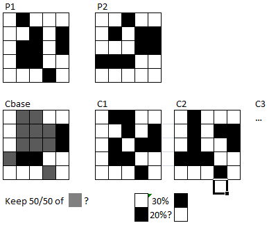

# cell-evolution

### Evolution algorithm
1) generate random generation (first)
2) apply simulation on generation
3) evaluate individuals with fitness function
4) Breed new individuals with crossover and mutation
5) replace least-fit with new individuals
6) to to 2

#### crossover
create new individuals with
- combine/merge parents
- same cells continue to be cells
- "new" cells get randomized

#### mutation
- create mutation on new generation ( by individual)
- randomize

#
